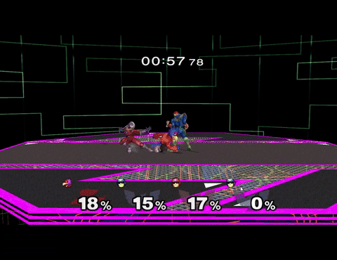

# MeleeVS - Melee Tag Fighter


https://ko-fi.com/joyastick

A gameplay mod for Super Smash Bros. Melee
(NTSC-U 1.02) adding a 2-vs-2 tag mode: each human "point" fighter can call in
a partner "assist" fighter mid-match, similar to *Marvel vs. Capcom* switching
or *2XKO*-style assist calls, instead of Melee's normal
1-life-per-slot model. Each team can be **Solo Play** (one human point
character with a CPU assist) or **Duo Play** (two humans sharing a team, each
on their own controller). The mod lives almost entirely in
[`src/melee/mod/`](src/melee/mod), layered as a thin, largely non-matching
addition on top of the real, already-decompiled game code rather than a fork
of the engine itself.

Built on top of "melee-pc", whose own online play with rollback netcode is
still in development: on this branch two copies play over a LAN or a direct
IP (see [Netplay](#netplay-lan-and-direct-ip-prototype)); internet
matchmaking is **not implemented yet**.

This repository is a fork of
[999sian/melee-pc](https://github.com/999sian/melee-pc), a native PC port of
Melee built from [doldecomp/melee](https://github.com/doldecomp/melee) on top
of [aurora](https://github.com/encounter/aurora) (GX/OS/PAD/DVD/CARD/THP
compatibility layer with a WebGPU backend) and SDL3. Everything melee-pc
provides - the native build, launcher, settings overlay, HD texture packs,
custom soundtrack streaming, and so on - still applies here; this fork adds
the Tag Fighter mod on top of it. For melee-pc's own feature list, porting
notes, and contributing guide, see
[the upstream README](https://github.com/999sian/melee-pc/blob/master/README.md).

You need your own disc image. **No game data ships here.** The decompiled game
code is not licensed and is not relicensed by this project; only the port code
is GPL-3.0-or-later. Details under [License](#license).

> New here? The **[project site](https://999sian.github.io/melee-pc/)** has the
> five-step setup, the FAQ (supported disc, Windows first run, older Intel GPUs,
> first-use shader stutter, Android requirements, where the log and settings
> live) and the per-platform known-issues list. Bugs go through the
> [bug report form](https://github.com/999sian/melee-pc/issues/new?template=bug_report.yml);
> questions on [Discord](https://discord.gg/aurt34svq).


## MeleeVS Features and Roadmap

### It features: 
[x] Assists for every character - Press D-Pad Down to perform a predetermined assist move for each character

[x] Active Tag - When both characters are on the screen at the same time, press D-Pad Down to swap 'Point' between them

[x] Multiple 'Freestyle' tags - Ability to active tag 3 times per assist call

[x] 2XKO-Like Duos - Team up with your friends to create crazy combos

[x] Tag Animation Canceling - Cancel any animation the character was in (besides getting hit/grabbed) into full control of the character

### Planned Roadmap

[] Early Fall 2026 - 2 Player Online Play (Direct Connect): Can connect to one other MeleeVS player with Rollback Netcode
[] Late Fall 2026 - 4 Player Online Play (Direct Connect): Can connect with up to 4 total MeleeVS players with Rollback Netcode

## Download

Tag Fighter builds (with the mod included) are on
[this fork's releases page](https://github.com/Joyastick/melee-pc-TagFighter/releases) -
not upstream's, which only ever ships vanilla melee-pc. Grab the
`Melee-Windows-x86_64-vX.Y.Z.zip` asset from the latest release, unzip
it, and run `melee.exe` (see [Running](#running) below for disc requirements).

```sh
./Melee-x86_64-vX.Y.Z.AppImage                  # open the launcher
./Melee-x86_64-vX.Y.Z.AppImage /path/to/melee.iso
```

No disc data is needed to build. The two HSD font atlases are pixel data from
the retail DOL, so instead of being committed they are read out of the disc
you supply, at boot (`src/pc/discfont.c`).

The release artifacts are produced by the same scripts CI runs, so they work
locally too. Windows cross-compiles from Linux with MinGW-w64; Android needs an
NDK (`ANDROID_NDK_HOME`) and a JDK 17. Each sets its output version from the
`MELEE_VERSION` environment variable (defaults to `0.0.0` when unset).

```sh
tools/package_linux.sh      # dist/Melee-x86_64-vX.Y.Z.AppImage + tarball
tools/package_windows.sh    # dist/Melee-Windows-x86_64-vX.Y.Z.zip
tools/build_android.sh      # dist/Melee-Android-arm64.apk (signed release)
```

## Playing MeleeVS

MeleeVS has its own entry in the main menu, so a normal VS Mode or Team
Battle match plays exactly like vanilla Melee and is unaffected by any of
this.

**Start a Tag Battle**: Main Menu → VS Mode → **MELEE VS** (the entry below
ONLINE). This drops straight into character select - its own two-tone
"MeleeVS" title replaces the usual mode banner - with all 4 doors already
open and paired up 2v2 - ports 1 and 3 on Red, ports 2 and 4 on Blue, each
Human if a controller is plugged into that port or CPU otherwise - so you can
go straight to picking characters instead of opening doors one at a time.
Switching to a different VS Mode entry (Melee, Tournament, Special Melee)
leaves Tag Battle behind; there's no in-CSS toggle for it anymore.

**Pick your team**: each door's team-color button cycles between Red and Blue
only (Green is unavailable - a 2v2 mode has no room for a third team), and a
door can't be closed either - its toggle just flips between CPU and Player
(Player only if a controller is on that port). Whoever picks Red plays
together, whoever picks Blue plays together - team pairing isn't tied to
which port you're in. A team is **Solo Play** if only one of its two doors is
human (the other stays CPU), or **Duo Play** if both are human, sharing the
team on their own controllers.

**Pick your point character**: press **Z** anywhere on a door's card. That
player becomes their team's point (human-controlled) character, their
teammate becomes the assist, and a colored **POINT** tag appears on their
door in their team's color. If nobody presses Z, the lower port number on
each team is point by default.

**Start**: requires exactly 2 players on Red and 2 on Blue.

- **Call an assist**: D-Pad Down. The assist spawns already performing its
  assigned move (grounded or airborne, depending on the point character's own
  state). While it's out, both fighters get a nametag showing everything you
  need to track the call at a glance:
  - **Point: N** over the active fighter, where `N` is how many more tags
    are still allowed this call (starts at 3, counts down as you use them).
  - A live countdown over the assist, showing how long until it auto-benches
    (shown as "..." instead if it's mid-hitstun/grabbed/etc. and the bench
    is briefly waiting that out).
- **Tag**: D-Pad Down again while the assist is out swaps which of the two is
  point. The fighter you tag into instantly cancels whatever it was doing and
  you get full control right away - unless it's genuinely unable to act
  (hitstun, grabbed, frozen, and other exotic "stuck" states), in which case
  it plays that out naturally first instead of handing you a free escape. Up
  to 3 tags are allowed per call, each on its own short cooldown, and tagging
  doesn't restart the assist's cameo timer.
- Ice Climbers bench/unbench Popo and Nana together.
- **Point runs out of stocks**: the assist is promoted to point instead of
  ending the team's run. If the sole survivor has more than one stock left,
  pressing **D-Pad Down** (the same assist-call input) donates one of their
  own stocks to revive the eliminated teammate back in as the assist.


### Character assist moves

In v1, the aerial assist call is the same move as the grounded one for every
character (tracked as a future refinement, not a limitation you need to work
around). Kept in sync with
[docs/tag_assist_roster.csv](docs/tag_assist_roster.csv) - update that file
first if a mapping below goes stale.

| Character | Grounded assist | Aerial assist |
|---|---|---|
| Mario | Neutral Special (Fireball) | Same as grounded |
| Dr. Mario | Down Special (Tornado) | Same as grounded |
| Fox | Up Smash | Same as grounded |
| Falco | Neutral Special (Blaster) | Same as grounded |
| Captain Falcon | Neutral Special (Falcon Punch) | Same as grounded |
| Ganondorf | Down Special (Wizard's Foot) | Same as grounded |
| Zelda | Up Smash | Same as grounded |
| Sheik | Up Smash | Same as grounded |
| Donkey Kong | Neutral Special (Giant Punch, released instantly uncharged) | Same as grounded |
| Bowser | Up Special (Whirling Fortress) | Same as grounded |
| Mr. Game & Watch | Neutral Special (Chef) | Same as grounded |
| Ice Climbers | Down Special (Blizzard) | Same as grounded |
| Luigi | Down Special (Luigi Cyclone) | Same as grounded |
| Marth | Neutral Special (Shield Breaker) | Same as grounded |
| Roy | Neutral Special (Shield Breaker) | Same as grounded |
| Yoshi | Up Special (Egg Throw) | Same as grounded |
| Mewtwo | Side Special (Confusion) | Same as grounded |
| Peach | Down Smash | Same as grounded |
| Samus | Side Special (Missile) | Same as grounded |
| Pikachu | Down Special (Thunder) | Same as grounded |
| Pichu | Neutral Special (Thunder Jolt) | Same as grounded |
| Jigglypuff | Side Special (Pound) | Same as grounded |
| Kirby | Side Special (Hammer Flip) | Same as grounded |
| Link | Up Special (Spin Attack) | Same as grounded |
| Young Link | Side Special (Boomerang) | Same as grounded |
| Ness | Side Special (PK Fire) | Same as grounded |


## Controls

Keyboard: arrows or WASD = stick, IJKL = C-stick, X = A, Z = B, C = X, V = Y,
Q/E = L/R, Tab = Z, Enter = Start, TFGH = D-pad. Gamepads work through SDL; an
official GameCube adapter is read directly instead (see the status table).

| | Keyboard | Gamepad |
|---|---|---|
| Navigate | Up/Down, Tab | D-pad or left stick |
| Adjust | Left/Right | D-pad left/right |
| Change tab | Left/Right on the tab strip | L/R shoulders |
| Select | Enter | A |
| Close overlay | Escape, F1 | B, Start, Back |

## Settings overlay

**F1**, or Back/Select on a gamepad, opens the overlay. The game pauses while it
is open.

- Display: fullscreen/windowed and VSync apply immediately. `MELEE_VSYNC`
  overrides the saved preference.
- Internal resolution and UI scale are sliders. UI scale covers 75% to 150%.
- Post-processing picks the presentation shader and applies immediately.
- Anti-aliasing and anisotropic filtering apply on the next launch. MSAA offers
  only off and 4x because WebGPU guarantees sample counts 1 and 4.
- Audio: master volume, mute, FPS counter, all immediate.
- Controls remaps a gamepad. Pick the port, select a GameCube button, then press
  the physical button. Escape cancels, Restore resets the port. Back cannot be
  bound since it opens the menu. Sticks and triggers remap the same way, and a
  direction accepts either a stick axis or a button.

Melee's own menu sounds play in the overlay. Bindings are stored in aurora's
per-device `.controller` files; everything else shares `launcher.cfg`.


## Contributing & Coding Style

Please refer to [CODING_STYLE.md](CODING_STYLE.md) for architectural guidelines,
formatting standards, 64-bit portability rules, and verification procedures. Run
`python3 tools/check_style.py` before opening pull requests.

## Layout

- `src/melee/mod` - the Tag Fighter mod itself.
- `src/melee`, `src/sysdolphin` - game code from the decomp (upstream commit in
  `src/UPSTREAM_COMMIT`), adapted to the PC data model.
- `src/pc` - platform layer: main, OS/VI/GX glue, keyboard, audio mixer, THP,
  vertex-array sizing.
- `extern/aurora` - vendored aurora with local changes.

## Netplay (LAN and direct IP, prototype)

Netplay is currently only supported for regular vanilla gameplay, but planned for MeleeVS.
For more information check out [999sian/melee-pc](https://github.com/999sian/melee-pc) for the main branch for the PC Port.

Two copies of the game play a rollback match over UDP (`src/pc/net.c`;
design and current state in [docs/netcode-plan.md](docs/netcode-plan.md)).
Both must run the same build **and the same game image**, with no memory card
(`--no-card`). The LAN lobby announces a 32-bit id of the disc it booted
(region, revision, file-table shape and the DOL, so a code mod counts), and a
peer on a different image is listed as incompatible before a single game
packet is exchanged — same as a different build version. Internet friend-code
pairing also binds build and disc identity; the legacy direct-IP environment
path retains its older protocol-version-only check.

In the menus: VS Mode → ONLINE → LAN PLAY finds other
copies on the local network by mDNS and the first Start elects a host
(lowest install id wins a tie). In the launcher or F1 Online tab, set your name
and your friend's `NAME#XXXX` code, then choose DIRECT CONNECT. UNRANKED searches
for an opponent; RANKED runs a rated best-of-three set. PROFILE shows your code
and locally verified rating. Internet discovery may take about 30 seconds to
bootstrap and some NATs cannot support a direct peer connection. Legacy
`MELEE_LAN_DIRECT=ip:port` remains available for direct-IP sessions. The game port is UDP 41000 by default and discovery uses UDP
5353 multicast; allow both through the firewall (Windows asks on first
launch). The install id used for the election is `install_id` in
`launcher.cfg`.

If the link drops mid-match, the session no longer dies with it: after 7 s of
silence it enters a reconnect phase and resumes where it left off if the peer
comes back within 15 s and neither side's 64-frame input ring has been
outrun. The lobby shows "reconnecting"; a failure that cannot be resumed says
"Could not resume" instead of "Connection timed out".

A peer that is *loading* is not a peer that is gone. Silence is measured from
the last datagram the peer sent, not from how long this side has been
waiting: a machine whose game thread is inside a stage load, a character
load or a first-time shader compile keeps its sender running, so the link
carries it however long it takes and the transition screen simply waits.
Before that distinction existed, any load over 7 s froze both games on "NOW
LOADING" and one over ~22 s ended the session outright, which is what a
phone's first match cost.

**What works where.** Only Linux x86-64 has played real matches, but a Linux
recording now replays bit-identical on Windows, so the two builds compute the
same game.

| Platform | Netplay | Rollback | Notes |
|---|---|---|---|
| Linux x86-64 | yes | yes | the configuration everything below was measured on; longest run 36 minutes and 126k frames of match |
| Windows x86-64 / ARM64 | implemented | enabled | PE ranges cover both supported toolchains. x86-64 restore runs under Wine; ARM64 compiler-bridge and linked-range checks pass. Full Windows rollback gameplay remains unverified |
| macOS / iOS | builds; online gameplay unverified | enabled | Mach-O simulation sections support Intel/Apple Silicon macOS and ARM64 iOS. Cross-link/bridge checks pass; native restore is a macOS CI check. Device gameplay remains unverified |
| Android | runs on a device; found and joined a PC over LAN | enabled; gameplay unverified | Measured on a Pixel 8 Pro against Linux x86-64: mDNS discovery, election, handshake and 1800+ frames of synced menus at 10-16 ms ping and 0 % loss, both peers entering the CSS on the same frame. No match has been played to the end yet. New ARM64/x86-64 NDK-linked restore fixtures pass (ARM64 under QEMU), but device rollback gameplay is still unproven. The lobby holds the Wi-Fi multicast lock while it is open |

All supported builds require simulation snapshot sections and verify their
boundaries after linking. Audio/worker state remains excluded. Menus and scene
loading still synchronize without prediction; matches use rollback by default.
Allocation failure and the explicit debugging switch can still fall back to
lockstep. Unsupported compilers are rejected rather than producing a silently
lockstep-only platform build.

| Variable | Effect |
|---|---|
| `MELEE_NET=<host:port>` | Connect to that peer at boot, no lobby (`MELEE_NET_PLAYER` and the same `MELEE_SEED` on both sides). |
| `MELEE_NET_PORT=<n>` | Local UDP game port (default 41000). Two copies on one machine need different ports. |
| `MELEE_NET_PLAYER=0\|1` | Controller port the local player drives with `MELEE_NET`: 0 = P1/host, 1 = P2. |
| `MELEE_NET_DELAY=<n>\|auto` | Input delay in frames (default `auto`: 1–4 from ping and jitter, re-evaluated every 600 frames, changed only between matches). |
| `MELEE_NET_RECONNECT_MS=<ms>` | How long a broken link may take to resume (default 15000). `0` disables the reconnect phase: the session drops 7 s after the peer goes quiet, as it used to. Anything negative or unparseable falls back to the default. |
| `MELEE_LAN_TEST=1\|host` | LAN lobby without the menu; `host` presses Start once the title is up. Both set to `host` exercises a simultaneous Start. |
| `MELEE_LAN_DIRECT=<ip:port>` | Direct connect without the menu, at frame 300; set on both sides with the other's address. The lower `ip:port` hosts. |
| `MELEE_NET_HANDSHAKE_TEST=1` | Run the RULES/READY handshake at frame 300 with `MELEE_NET`, no lobby. |
| `MELEE_NET_STALL_TEST=<frame>[:<ms>]` | Park the guest's game thread for `ms` at that frame (default 10000), standing in for a load the netcode cannot shorten. The sender keeps running, so this is the "peer is loading, not gone" case; only player 1 does it, so one exported value stalls exactly one side. |
| `MELEE_NET_RECORD=<file>` | Write the seed, then per frame the four pad states simulated and a state checksum. |
| `MELEE_NET_REPLAY=<file>` | Feed a recording back in; reports the first frame whose checksum differs (`net: REPLAY DIVERGED`). Solo only. |
| `MELEE_NET_STATE_LOG=<file>` | Write two lines per frame to that file: the readable state line, and the raw float bits of exactly the fields the checksum covers. Only meaningful with `MELEE_NET_RECORD`/`MELEE_NET_REPLAY`; this is how two platforms' runs are diffed down to the field that differs. |
| `MELEE_INPUT_TRACE=1` | One `pad: ` line per change of port 0's virtual pad, with the focus and fifo state that produced it. |
| `MELEE_NET_SYNCTEST=1` | Run every tick twice from a restored snapshot and compare state hashes; sound is off. Proves the snapshot covers everything a tick reads. |
| `MELEE_NET_ROLLBACK=off` | Play the session in lockstep — no prediction, no snapshots. A bisecting tool, not a mode. |
| `MELEE_NET_SYNC=off\|legacy` | Measure the clock offset but never act on it, or restore the pre-batch skip behaviour. |
| `MELEE_NET_PAD_QTYPE=0` | Restore the raw pad queue's shifting overflow branch; the regression test for the input-slip fix. |
| `MELEE_NET_AUDIO_JOURNAL=off`, `MELEE_NET_AUDIO_DEAF=off` | Restore the two audio behaviours netplay overrides for determinism; each is the regression test for its own defect. |
| `MELEE_NET_RESIM_AUDIT=<k>` | Every 120 frames, roll back k frames and re-run them from unchanged inputs, comparing every snapshot region and checksum. The instrument that proves re-simulation is faithful. |
| `MELEE_NET_EXIT_AFTER_FRAMES=<n>` | Disconnect (BYE) and exit at that frame, logging `net: test done at frame n`. |
| `MELEE_NET_SIM_OOM_FRAME=<n>` | Fail the first snapshot taken at or after that frame, the way a failed allocation would, to exercise the lockstep fallback. |
| `MELEE_NET_SIM_LOSS=<pct>` | Drop that share of outgoing packets. |
| `MELEE_NET_SIM_DELAY_MS=<ms>` | Hold every outgoing packet that long. |
| `MELEE_NET_SIM_DELAY_RX_MS=<ms>` | Hold every incoming packet that long (asymmetric links). |
| `MELEE_NET_SIM_JITTER_MS=<ms>` | Uniform ±ms on the outgoing delay; reorders when larger than the delay. |
| `MELEE_NET_SIM_REORDER=<pct>` | Hold that share of packets behind the next one. |
| `MELEE_NET_SIM_DUP=<pct>` | Send that share of packets twice. |
| `MELEE_NET_SIM_BURST=<n>` | Every 5 s drop n consecutive outgoing packets. |

The link simulator's PRNG is seeded from `MELEE_NET_PORT`, so a run repeats.
Every 600 frames the log prints rollbacks, stalls, ping, jitter, loss and
snapshot cost; `net: DESYNC`, `net: cannot roll back` and `net: peer silent`
are the lines that mean something went wrong. Two copies on one machine also
need distinct `MELEE_CACHE_DIR` (pipeline cache) and `MELEE_KEY_FIFO` if you
drive them with key injection. Keyboard keys only reach the game while the
window has keyboard focus; `MELEE_KEY_FIFO` keys are deliberately exempt, so
harnesses can still drive menus in background windows.

A run that never leaves a menu proves nothing: outside a fight the state
checksum covers only the four pads and the RNG seed, so two title screens can
neither desync nor roll back. The harnesses below check that a match really
started before they report anything.

| Tool | What it does |
|---|---|
| `tools/net_test.py` | Two instances on this machine through a real match, asserting on both logs (both reach `net: test done`, exit 0, no DESYNC, no `peer silent`, no lost rollback). Direct mode boots straight into Link vs Mario via `MELEE_NET` + `MELEE_DEBUG_VS=1`; `--lan` walks the real menus into the LAN lobby and needs the shared LAN free; `--scenes` walks CSS and SSS too; `--oom FRAME` and `--disconnect` cover the snapshot-failure and hard-drop paths. |
| `tools/net_acceptance.py` | The same across a link matrix (loss, delay, jitter, reorder, dup, burst, asymmetric rx) into one markdown table. |
| `tools/net_lan_test.py` | Lobby paths a match never reaches: simultaneous Start, direct connect, a peer killed mid-lobby, the host killed while the guest connects. |
| `tools/net_determinism.py` | Records one run and replays it on every platform reachable from this machine, reporting the first frame that differs. Android and macOS report SKIPPED rather than passing. |
| `tools/net_fuzz.py`, `tools/net_lan_fuzz.py` | Malformed game datagrams and malformed mDNS records against a running instance. Both keep their crafted multicast on this host (`IP_MULTICAST_TTL 0`). |

```sh
python3 tools/net_test.py                                  # 2 min, clean link
python3 tools/net_test.py --loss 5 --delay 30 --jitter --reorder
python3 tools/net_test.py --lan --minutes 1
python3 tools/net_test.py --fuzz                           # tools/net_fuzz.py hammers A's port
python3 tools/net_determinism.py --only linux,linux-flip   # ~2 min, no Proton
```

`--exe build/melee`, `--disc ../melee.ciso`, `--port 42050` (B uses +1) and
`--work /tmp/net_test` (logs in `a.log`/`b.log`) are the defaults.

## Documentation

- [docs/building.md](docs/building.md) - toolchain, packaging, cross-compiling
  for Windows, Android, iOS and macOS.
- [docs/testing.md](docs/testing.md) - unit tests, drive/capture tools,
  port-bug harnesses.
- [docs/debugging.md](docs/debugging.md) - log files, crash handler, gdb, heap
  check, diagnostic environment variables.
- [docs/porting-notes.md](docs/porting-notes.md) - the big-endian data model,
  LP64 bug classes, PAL support.
- [docs/architecture.md](docs/architecture.md) - layers, threads, memory map,
  aurora.
- [ROADMAP.md](ROADMAP.md) - scope and sequencing of melee-pc's own remaining
  phases (not the Tag Fighter roadmap above).

For decomp porting notes, dev tools, and coding-style/contributing
guidelines, see
[the upstream README](https://github.com/999sian/melee-pc/blob/master/README.md)
and [CODING_STYLE.md](CODING_STYLE.md).

## License

Three situations, spelled out in [LICENSE.md](LICENSE.md): the decompiled
game code in `src/melee` and `src/sysdolphin` is **not licensed** and remains
the property of its copyright holders; the port code in `src/pc`, `tools`,
`platforms`, `cmake` and `.github` is **GPL-3.0-or-later** ([COPYING](COPYING));
bundled third-party components keep their own licenses. Because the game code
cannot be relicensed, the repository as a whole is not distributable under the
GPL. No game assets are in this repository.
